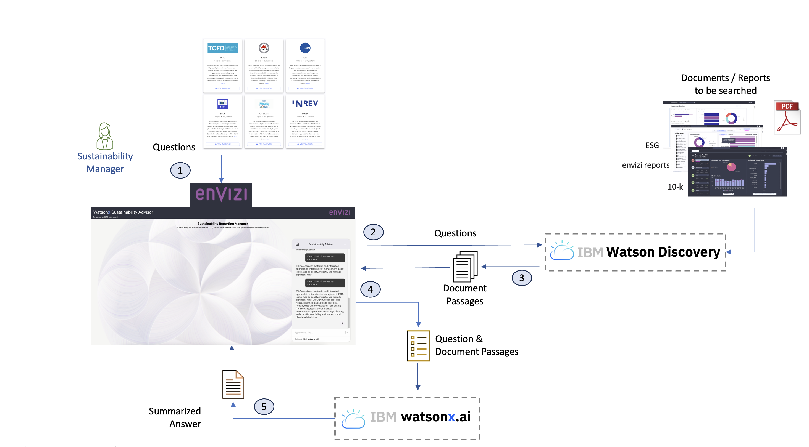

# Watsonx Sustainbility Advisor App

The Sustainability Reporting Manager in IBM Envizi spends a lot of time in preparing the responses to the various questions from the disclosure reports.

Watson-x Sustainability Advisor can help the sustainability reporting manager to get the responses to the various questions very quickly.

It leverages watsonx Assistant to take the questions from the sustainability reporting manager.

For the given question, the Watsonx Assistant gets the relevant text passages from the Watson Discovery that contains the various reports and informations loaded from the Envizi.

Once the passages are retrieved from the Watson discovery, this watsonx Assistant pass the passes to Watsonx.ai to make a summary out of it.

The summary response is shown to the user as an answer to their question.

## 1. Source code details

### 1.1 Watson Assistant UI and API


The `app` folder of this repo contains the python app code, which uses Watson Discovery, and Watsonx.ai  to respond to the queries from the UI.

The `web-wa` folder contains the `ReactJS UI` code and it opens up the `Watson-Assistant` in the screen. Then the Watson-Assistant would calls Watson Discovery, and Watsonx.ai  to respond to the queries of the user.

#### Solution Architecture

This solution follows RAG architecture model.  The tech stacks used here are the following
- Watsonx.ai
- Watson Assistant
- Watson Discovery
- LangChain



### 1.2 React UI and API

There is the React UI based version of Watsonx Sustainbility Advisor is also available.


The `web` folder contains the `ReactJS UI` code, which calls the above python app to query llm.

#### Solution Architecture

This solution follows RAG architecture model.  The tech stacks used here are the following
- Watsonx.ai
- Watson Discovery
- LangChain


## 2.Installation

### 2.1. Install python 3.9 version

1. Run the below commnad to install python 3.9 version.

```
brew install python@3.9
```

2. Run the below command to ensure python command uses homebrew’s version of python3

```
echo "alias python3=/opt/homebrew/bin/python3.9" >> ~/.zshrc
echo "alias python=/opt/homebrew/bin/python3.9" >> ~/.zshrc
```

### 2.2. Install dependent libraries

1. Run the below commnads to install the dependent libraries

```
python -m pip install python-dotenv
python -m pip install ibm-generative-ai
python -m pip install "ibm-generative-ai[langchain]"
python -m pip install pypdf
python -m pip install InstructorEmbedding
python -m pip install 'transformers[torch]'
python -m pip install sentence-transformers
python -m pip install Flask flask-restful flask_httpauth
python -m pip install cachetools
python -m pip install unstructured
python -m pip install chromadb
python -m pip install faiss-cpu

python -m pip install flask_cors
python -m pip install ibm-cos-sdk
python -m pip install rogue
python -m pip install ibm-watson

python -m pip install libffi-dev
```

### 2.3 Create .env file for the app

Create the .env file in the root folder of the app with the below content.

```
LOGLEVEL=DEBUG

### Watsonx.ai
GENAI_KEY=<REPLACE IT WITH YOUR IBM GENAI APIKEY>
GENAI_API=https://us-south.ml.cloud.ibm.com/ml/v1-beta/generation/text?version=2023-05-29
PROJECT_ID="2677a1e4-xxxxxxxx"

### Watson Discovery
WD_API_KEY=<REPLACE IT WITH YOUR WATSON DESCOVERY API KEY>
WD_SERVICE_URL=https://api.us-south.discovery.watson.cloud.ibm.com/instances/a83d0a4b-a6d9-41db-972a-5b70d5fc2c91
WD_PROJECT_ID=80c28471-xxxxxxx

### Dataset
DATA_PATH=./datasets
```

## 3. Starting the App

1. Goto the root folder of this app.

2. Run the below commnad to start the app in virtual environment called `venv` .

```
python -m venv myvenv
source myvenv/bin/activate
python app/main.py
```

## 4. To deactivate the virtual environment

1. Goto the root folder of this app.

2. Run the below commnad to deactivate the virtual environment.

```
deactivate
```

